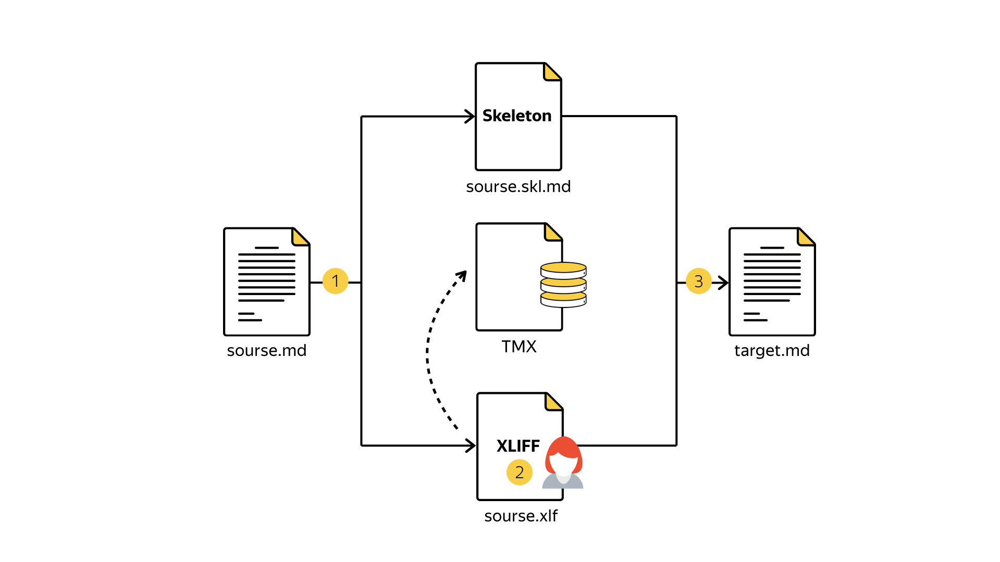

# md2xliff

Markdown to [XLIFF](http://www.oasis-open.org/committees/xliff/documents/xliff-specification.htm) and XLIFF to markdown converter.

Idea behind it is described at [XML in Localisation: Use XLIFF to Translate Documents](http://www.maxprograms.com/articles/xliff.html) article.

Package provides `extract` module which parses markdown files and generates XLIFF and skeleton.

Translater fills XLIFF with translations. `pretranslate` module may be used for automatic translation with the help of Yandex [Translator API](https://tech.yandex.com/translate/).

[Online XLIFF Editor](http://xliff.brightec.co.uk/) may be used to work with XLIFF files.

Then with `xliff-reconstruct` module it is possible to build translated markdown with the same markup as in source document.

## Installation requirements

* [Node.js 4+](https://nodejs.org) is a platform built on JavaScript runtime for easily building fast, scalable network applications.
* [Git Bash](https://git-for-windows.github.io/) if you use Windows OS.

## Installation

It's as easy as...

```bash

npm install md2xliff

```

**Note:** Do not use `root` rights to install `npm` dependencies.

## Usage



All modules have JS API and a CLI.

### Step 1 — extract

To extract XLIFF and generate skeleton run `./bin/extract test/source.md`.

### Step 2 — translate

To translate XLIFF file you can use a text editor or any CAT tools ([MateCat](https://www.matecat.com ), [Swordfish](http://www.maxprograms.com/products/swordfish.html)).

Also you can automatically pretranslate XLIFF file. For this run `API_KEY=your-yandex-translator-api-key ./bin/pretranslate test/source.xlf`.

It is also possible to set `JUST_UPPER_CASE` environment variable to use upper case of `source` units instead of translation which may be useful for testing: `JUST_UPPER_CASE=1 ./bin/pretranslate test/source.xlf`.

### Step 3 — reconstruct

To reconstruct new markdown from XLIFF and skeleton built with `extract` command run `./bin/reconstruct test/source.xlf test/source.skl.md test/target.md`.

Environment variable `USE_SOURCE` may also be used to reconstruct target markdown from `<source>` units of XLIFF. It is helpful for testing: `USE_SOURCE=1 ./bin/xliff-reconstruct test/source.xlf test/source.skl.md test/target.md`.
